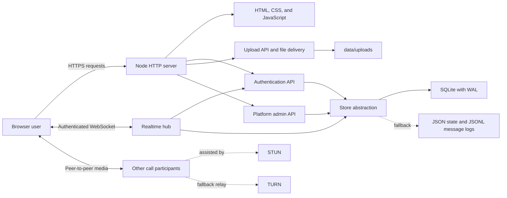

# Roomly Website Functional Export and System Plan

> Current implementation reference for Roomly 2.0
> Reviewed against the repository on 2026-07-30

## 1. Purpose of this document

This document explains what every major part of the Roomly website does, how the parts communicate, which users can perform each action, where data is stored, and how the application should be operated and extended.

It is intended to be the working reference for:

- Product and UX planning
- Frontend development
- Backend development
- Realtime and WebRTC work
- Administration and moderation
- Deployment and operations
- Testing and future scaling

The code remains the final source of truth. This export describes the current implementation, not only an intended future design.

---

## 2. Product summary

Roomly is a self-hosted browser communication product. It combines:

- Registered accounts and temporary guest identities
- Community spaces
- Text channels
- Voice and video rooms
- Screen sharing
- Direct messages
- Message history and attachments
- Replies, edits, reactions, mentions, and typing state
- Profiles, avatars, statuses, pronouns, and privacy controls
- Space roles and moderation
- Platform-wide administration

The application runs as one Node.js process with one installed dependency, `ws`. The browser client uses native JavaScript, CSS, WebSocket, MediaRecorder, and WebRTC APIs. No frontend build step is required.

---

## 3. System architecture



### Runtime responsibilities

| Layer | Responsibility |
|---|---|
| Browser UI | Navigation, rendering, forms, composer, media controls, responsive layout |
| HTTP server | Static assets, authentication, uploads, admin API, health endpoint |
| WebSocket hub | Live state, authorization, fan-out, messaging, moderation, presence, signaling |
| WebRTC engine | Microphone, camera, screen share, peer connections, recovery, bitrate tuning |
| Store | Users, sessions, spaces, channels, DMs, messages, reactions, uploads metadata |
| Admin console | Instance metrics, account control, server control |

---

## 4. Repository file map

| File | Function |
|---|---|
| `server.js` | Application entrypoint, configuration, HTTP routes, uploads, admin API, shutdown |
| `index.html` | Complete public app shell, auth screens, chat, calls, navigation, overlays |
| `styles.css` | Base application styling and older visual layers |
| `refinement.css` | Final Roomly design system, UX corrections, responsive behavior |
| `app.js` | Main browser controller, state, rendering, flows, forms, socket event handling |
| `js/socket.js` | WebSocket connection, request/ack protocol, reconnection |
| `js/rtc.js` | WebRTC voice, video, screen share, peer mesh, connection recovery |
| `js/markdown.js` | Safe message formatting and message previews |
| `js/emoji.js` | Emoji groups and quick reactions |
| `js/fx.js` | Optional UI effects and speaking-level visualization |
| `js/util.js` | DOM helpers, icons, avatars, dates, clipboard, sounds, debounce |
| `lib/auth.js` | Registration, login, guest access, sessions, cookies, password hashing |
| `lib/hub.js` | Realtime protocol, permissions, spaces, channels, DMs, messages, calls |
| `lib/store.js` | Persistence abstraction and JSON-file fallback |
| `lib/db.js` | SQLite backend and legacy message migration |
| `admin.html` | Platform administration page |
| `admin-console.js` | Admin API client, tables, searches, destructive actions |
| `admin.css` | Base admin styling |
| `admin-refinement.css` | Final admin design system |
| `README.md` | User-facing overview, setup, configuration, and production notes |
| `SCALING.md` | Growth path from one process to distributed infrastructure |
| `PRODUCT.md` | Product purpose, users, principles, personality, and accessibility goals |
| `DESIGN.md` | Current visual system, typography, colors, components, and motion |
| `Dockerfile` | Production container definition and health check |
| `start-server.bat` | Windows double-click launcher |
| `package.json` | Node metadata, commands, supported runtime, dependency declaration |

---

## 5. User types and permission model

### 5.1 User types

| User type | Description |
|---|---|
| Visitor | Not authenticated; can sign in, register, or continue as a guest |
| Guest | Temporary identity; can communicate and host one temporary space |
| Registered account | Persistent identity with username and password |
| Space member | Normal participant in one space |
| Space admin | Can manage channels, space settings, and lower-ranked members |
| Space owner | Created the space; has full space control and can delete it |
| Platform admin | Operates the entire Roomly instance through `/admin` |

### 5.2 Space permission matrix

| Action | Member | Space admin | Space owner |
|---|---:|---:|---:|
| Read space channels | Yes | Yes | Yes |
| Send messages | Yes | Yes | Yes |
| Join voice rooms | Yes | Yes | Yes |
| Leave the space | Yes | Yes | Not through normal leave flow |
| Update space name/icon | No | Yes | Yes |
| Reset invite link | No | Yes | Yes |
| Create/update/delete channels | No | Yes | Yes |
| Delete another user's message | No | Yes | Yes |
| Kick lower-ranked users | No | Yes | Yes |
| Ban/unban lower-ranked users | No | Yes | Yes |
| Promote or demote members | No | Yes, lower rank only | Yes |
| Delete the entire space | No | No | Yes |

Role ranking is:

1. Owner
2. Admin
3. Member

An actor cannot moderate themselves or someone with an equal or higher role.

### 5.3 Platform administrator abilities

- View account, guest, server, message, upload, presence, voice, database, and uptime metrics
- Search users
- Disable or enable accounts
- Reset a registered user's password
- Promote a registered user to platform admin
- Demote an admin
- Delete users
- Delete any space and its message history
- Force-disconnect disabled or deleted users

The first registered account automatically becomes the first platform administrator. Additional admins can be granted through `ADMIN_USERS` or the admin console.

---

## 6. Complete website UI map

## 6.1 Splash screen

Purpose:

- Gives the first load a branded visual state
- Prevents the uninitialized auth/app shell from flashing
- Disappears after authentication state and initial application state are known

Behavior:

- Appears before the auth view or app view
- Uses a short controlled delay
- Does not contain an application action

## 6.2 Authentication view

The authentication page contains three modes.

### Sign in

- Username input
- Password input
- Sends `POST /api/login`
- Displays validation or authentication errors inline
- Creates an authenticated session cookie on success

### Create account

- Username
- Display name
- Password
- Sends `POST /api/register`
- Usernames accept lowercase letters, numbers, dots, and underscores
- Passwords require at least 8 characters
- The first registered account receives platform-admin access

### Guest

- Display name only
- Sends `POST /api/guest`
- Creates a temporary guest user and a seven-day guest session
- Guests can join spaces and communicate
- Guests can host one temporary space at a time

### Invite entry behavior

An invite URL has the form:

```text
/invite/<code>
```

The server returns the normal app shell. The client stores the code, completes authentication if required, joins through the WebSocket operation `join-invite`, opens the space, and replaces the browser URL with `/`.

## 6.3 Main application shell

The authenticated shell has:

- Left navigation sidebar
- Main content pane
- Optional contextual activity panel
- Mobile bottom navigation
- Global overlays and popovers

### Adaptive sidebar

The sidebar contains:

- Roomly brand
- Overview
- Calls
- Messages
- People
- Spaces
- Settings
- Roomly search
- Space and room directory
- Direct-message list
- Persistent voice dock
- Create Space and Enter Invite actions
- Current profile

On shorter desktop screens, the six primary destinations use a compact two-column grid. This protects vertical room for channels and live rooms without hiding navigation.

On mobile:

- The application becomes one working pane
- The primary destinations move to a bottom navigation bar
- Spaces and conversations open as a dedicated pane/drawer
- Controls maintain touch-friendly target sizes

## 6.4 Overview dashboard

The Overview page answers what the user can do next.

It contains:

- Time-aware greeting
- New voice call action
- New video call action
- Upcoming or active live-room summary
- Recent conversations
- User's spaces
- Create-space action
- Enter-invite action
- Helpful empty states when no spaces or conversations exist

The page derives its information from the `ready` snapshot and live WebSocket updates.

## 6.5 Calls destination

Purpose:

- Finds an available voice room
- Moves the user toward starting or joining a live room
- Uses the same voice-room state shown in the space directory

If no suitable room exists, the flow guides the user to create or open a space.

## 6.6 Messages destination

Purpose:

- Shows direct-message conversations
- Provides user lookup by exact username
- Opens existing recent conversations
- Tracks unread state and mentions

The Find User flow:

1. User enters an exact registered username.
2. Client sends `find-user`.
3. The user preview is returned.
4. Client sends `dm-open`.
5. Existing DM is reused, or a new DM thread is created.
6. Both participants receive `dm-added` when a new thread is created.

## 6.7 People destination

Purpose:

- Opens user discovery
- Provides access to member profiles
- Shows online/offline state
- Allows starting a DM from a user profile

Inside a space, members are grouped into:

- Online
- Offline

Each member row can show:

- Avatar
- Display name
- Pronouns
- Owner crown
- Admin shield
- Guest label
- Custom status

## 6.8 Spaces destination

Purpose:

- Create a space
- Enter an invite
- Select an existing space
- Browse text and live rooms
- Access space settings according to role

### Create space

Registered account:

- Creates a permanent space
- May participate in up to 50 spaces

Guest:

- Creates one temporary space
- Default life is 24 hours
- The expiration value is configurable
- Expired spaces are removed automatically

Every new space receives:

- A `general` text channel
- A `Lounge` voice channel
- A unique invite code
- Creator membership with owner role

### Join by invite

- Validates invite existence
- Rejects banned users
- Rejects users already at the space limit
- Adds membership with member role
- Sends the space and visible users to the joining client
- Broadcasts the new member to current members

### Space settings

Available to the owner and space admins:

- Rename space
- Change emoji/icon
- Copy invite link
- Reset invite code
- Create text channel
- Create voice channel
- Review or manage members

Owner-only:

- Delete space

Deleting a space removes:

- Space record
- Invite
- Membership index
- Voice rooms
- All channel message logs
- The space from every member's client

## 6.9 Text channels

Text channels support:

- Name
- Topic
- Position
- Last activity timestamp
- Message history
- Unread state
- Mention count

Administrative channel actions:

- Create
- Rename
- Change topic
- Delete

Channel names are normalized to lowercase URL-like text using letters, numbers, hyphens, spaces, and underscores. Spaces/underscores become hyphens.

## 6.10 Direct messages

Direct messages are private two-user threads.

Functions:

- Open by exact username or member profile
- Reuse existing thread between the same pair
- Persistent message history
- Attachments, reactions, replies, edits, deletes, and voice notes
- Online/offline display for the other participant
- Unread and mention tracking

DM channel keys use:

```text
dm:<dmId>
```

Space text and voice channel keys use:

```text
srv:<spaceId>:<channelId>
```

## 6.11 Chat view and message composer

### Message list

The chat view renders:

- Channel/DM introduction
- Chronological message list
- Compact consecutive messages from the same author
- Day and time labels
- Edited state
- Deleted state
- Reply context
- Attachments
- Reactions
- Message action menu
- Load Older control

### Composer

The composer supports:

- Up to 4,000 characters
- Enter to send
- Shift+Enter for a new line
- Arrow Up on an empty composer to edit the user's latest message
- Reply mode
- Edit mode
- Emoji picker
- Mention autocomplete
- File picker
- Drag and drop
- Clipboard image/file paste
- Voice-message recording

### Mentions

- Users are selected through autocomplete
- The client stores mentions in token form: `<@userId>`
- The renderer displays the current user name
- The server extracts and stores up to 20 mentioned user IDs
- Mention counts are recalculated during initial sync and updated live

### Replies

- A message may reference another message ID
- Reply mode is visible above the composer
- Sending includes `replyTo`
- Canceling clears reply state

### Editing

- Only the author may edit a message
- Edited content must not become empty unless attachments remain
- Mentions are recalculated
- `editedAt` is added
- All channel participants receive `message-updated`

### Deletion

Allowed for:

- The author
- Space owner
- Space admin

Deletion is a soft message tombstone:

- `deleted` becomes true
- Text is cleared
- Attachments are cleared
- Reactions are cleared

### Reactions

- Quick reactions are available
- Any non-empty emoji within the limit can be stored
- Reaction membership is stored by user ID
- A message can have up to 20 different reaction keys
- Clicking an existing reaction toggles the current user

### Typing state

- Sent as a lightweight WebSocket event
- Throttled to one broadcast per user/channel every two seconds
- Client typing indicators expire after four seconds
- Not stored permanently

### Read state and unread state

- Stored per user as `lastRead[channelKey]`
- Sending a message also marks the sender current
- Reaching the bottom while the document is focused marks the channel read
- Mentions and document title are updated from read state

## 6.12 Attachments

Upload flow:

1. Browser sends raw bytes to `POST /api/upload`.
2. Original filename is Base64 encoded in `X-File-Name`.
3. Server sanitizes the name.
4. Server enforces the configured size limit.
5. File is assigned a random stored name.
6. File is written to `data/uploads`.
7. Attachment metadata is returned.
8. Composer includes the metadata in `send`.

Supported inline types:

- PNG
- JPEG
- GIF
- WebP
- MP3
- WAV
- OGG
- MP4
- WebM
- PDF
- Plain text

Unknown or active types are served as downloads instead of inline content.

Per-message attachment limit: 6.

## 6.13 Voice messages

Voice messages use the browser `MediaRecorder`.

Flow:

- User starts recording from the composer
- Recording duration is shown
- User can cancel or send
- Audio blob is uploaded through `/api/upload`
- The returned attachment is sent as a normal message
- Recipients receive an inline audio player

## 6.14 Voice and video rooms

### Before joining

The room view shows:

- Room identity
- Current participants
- Join with microphone
- Join with camera
- Room capacity state

### During a call

Available controls:

- Mute/unmute microphone
- Enable/disable camera
- Start/stop screen sharing
- Pin participant
- Unpin participant
- Fullscreen stage
- Leave room
- Open voice-room text chat

### Persistent voice dock

When the user navigates away from the live-room page, the sidebar dock keeps:

- Connection status
- Room name
- Microphone control
- Camera control
- Screen-share control
- Disconnect control

### Participant tiles

Tiles can show:

- Avatar or live camera
- Display name
- Speaking state
- Muted/camera/screen state
- Connection state
- Retry control after failed peer recovery

### Screen-share stage

- Shared content receives stage priority
- Camera tiles remain available
- Double-clicking the stage toggles fullscreen
- Controls stay reachable in fullscreen
- A user can stop their own share from multiple controls

## 6.15 Activity panel

The contextual right panel has three tabs.

### Activity

On Overview:

- Live rooms across all spaces
- Recent DMs

Inside a space:

- Online count
- Number currently in voice
- Total members
- Total rooms
- Voice-room shortcuts

Inside a DM:

- Other user's identity
- Online/offline state
- Explanation of private conversation content

### People

- Available only when a space context exists
- Groups members by online/offline state
- Sorts owner, admin, then member
- Opens the user profile popover

### Assist

This is an on-device heuristic, not a remote AI service.

Functions:

- Summarizes the most recent loaded messages
- Extracts likely decisions and next steps using local keyword matching
- Sends no conversation data outside the browser
- Works only on messages already loaded into the current client

## 6.16 Search

### Header global search

Searches the client state for:

- People
- Spaces
- Messages/conversation destinations

It provides navigation to matching local results.

### Sidebar search

Filters the currently rendered:

- Spaces
- Text channels
- Voice channels
- Direct-message rows

It does not query the complete server message history.

## 6.17 Notifications and feedback

The UI uses:

- Toast messages
- Inline form errors
- Connection-lost banner
- Unread badges
- Mention badges
- Browser title updates
- Join/leave sounds
- Presence dots
- Speaking rings
- Loading/empty states

## 6.18 Profiles and settings

### Profile fields

- Immutable username/handle for registered users
- Editable display name
- Avatar image
- Fallback avatar color
- Pronouns, maximum 32 characters
- About Me, maximum 190 characters
- Custom status text and emoji
- Profile privacy

Avatar uploads accept static PNG and JPEG files only.

### Status

- Text, maximum 64 characters
- Emoji
- Until manually cleared
- One hour
- Twenty-four hours
- Server-side maximum expiration of seven days

Expired statuses are omitted from the public user view.

### Profile privacy

| Setting | Who can see full profile details |
|---|---|
| Everyone | Any authenticated user who can request the profile |
| Small spaces and DMs | DM contacts and shared spaces with 200 or fewer members |
| DM contacts only | The user and existing DM contacts |

Avatar, display name, and username remain part of the public identity view.

## 6.19 Administration console

URL:

```text
/admin
```

### Gate behavior

- Page shell is public
- Admin data APIs require a platform-admin session
- Non-admin users see a gated message

### Overview metrics

- Registered accounts
- Guests
- Disabled accounts
- Spaces
- Temporary spaces
- Online users
- Participants currently in voice
- Stored message count when SQLite is available
- Upload file count and bytes
- Storage engine
- Process uptime

### User table

- Search by username or display name
- Shows creation date
- Online/offline/disabled state
- Number of spaces owned
- Guest/admin labels
- Disable/enable
- Reset password
- Promote to admin
- Delete

### Space table

- Name/icon
- Owner
- Member count
- Channel count
- Permanent/temporary state
- Delete action

Overview metrics refresh every 15 seconds. User and space tables refresh after actions.

---

## 7. Client application model

`app.js` owns the browser application state.

Major state groups:

- Current user
- Current WebSocket connection ID
- Current route/view
- Spaces
- DMs
- Public users
- Online users
- Voice occupancy
- Loaded message buckets
- Typing users
- Last-read timestamps
- Mention counts
- Pending attachments
- Reply/edit state
- Current voice call
- Pinned participant/stage
- Mobile pane
- Activity-panel state
- Pending invite code

### Supported view kinds

| View kind | Meaning |
|---|---|
| `home` | Overview dashboard |
| `text` | Space text channel |
| `dm` | Direct-message conversation |
| `voice` | Space voice/video room |

### Rendering model

The app uses direct DOM rendering rather than a framework.

Key render groups:

- `renderAll`
- `renderRail`
- `renderSidebar`
- `renderHome`
- `renderMainView`
- `renderActivityPanel`
- `renderMembers`
- `renderVoiceDock`
- `renderVoiceView`
- `rebuildMessageList`

The `ready` event is treated as a complete source-of-truth snapshot after first connection and every reconnect.

---

## 8. HTTP API reference

| Method | Route | Authentication | Function |
|---|---|---|---|
| `GET` | `/health` | No | Health, user count, space count, online count |
| `GET` | `/api/me` | Session | Returns current user and platform-admin state |
| `POST` | `/api/register` | No | Creates registered account and session |
| `POST` | `/api/login` | No | Validates password and creates session |
| `POST` | `/api/guest` | No | Creates guest identity and session |
| `POST` | `/api/logout` | Session optional | Deletes session and clears cookie |
| `POST` | `/api/upload` | Session | Stores one raw upload and returns metadata |
| `GET/HEAD` | `/uploads/<file>` | No | Safely serves uploaded content |
| `GET` | `/api/admin/overview` | Platform admin | Returns platform metrics |
| `GET` | `/api/admin/users?q=` | Platform admin | Returns up to 500 matching users |
| `POST` | `/api/admin/users` | Platform admin | User administration actions |
| `GET` | `/api/admin/servers` | Platform admin | Returns up to 500 spaces |
| `POST` | `/api/admin/servers` | Platform admin | Platform-level space deletion |
| `GET/HEAD` | `/invite/<code>` | No | Serves app shell for invite flow |
| `GET/HEAD` | `/` and static paths | No | Serves application assets |

Authentication POST bodies are limited to 64 KB. Upload bodies are limited by `MAX_UPLOAD_MB`.

---

## 9. WebSocket protocol

Connection URL:

```text
/ws
```

Authentication:

- Uses the HTTP-only session cookie during upgrade
- Unauthorized upgrades receive HTTP 401
- Maximum WebSocket payload is 256 KB

### 9.1 Request format

```json
{
  "op": "operation-name",
  "req": 123,
  "additionalField": "value"
}
```

`req` is optional for fire-and-forget operations.

### 9.2 Acknowledgement format

```json
{
  "t": "ack",
  "req": 123,
  "ok": true
}
```

Errors include:

```json
{
  "t": "ack",
  "req": 123,
  "ok": false,
  "error": "Human-readable error"
}
```

### 9.3 Client-to-server operations

| Operation | Function |
|---|---|
| `ping` | Connectivity request with server timestamp |
| `ice` | Retrieves fresh STUN/TURN configuration |
| `create-server` | Creates a permanent or guest temporary space |
| `update-server` | Changes space name/icon |
| `delete-server` | Owner deletes entire space |
| `leave-server` | Member/admin leaves |
| `join-invite` | Joins through invite code |
| `regen-invite` | Replaces the active invite code |
| `create-channel` | Creates text or voice channel |
| `update-channel` | Changes channel name/topic |
| `delete-channel` | Deletes channel and its history |
| `kick` | Removes a lower-ranked member |
| `ban` | Removes and blocks a lower-ranked member |
| `unban` | Removes a ban |
| `set-role` | Promotes/demotes eligible member |
| `messages` | Loads a page of message history |
| `send` | Sends message, attachments, reply, mentions |
| `edit` | Edits author's message |
| `del-msg` | Soft-deletes authorized message |
| `react` | Adds/removes reaction |
| `typing` | Broadcasts temporary typing state |
| `read` | Advances last-read timestamp |
| `find-user` | Finds registered user by username |
| `dm-open` | Creates or opens a DM |
| `profile` | Updates display name, avatar, color, pronouns, bio, privacy |
| `status-set` | Creates or clears custom status |
| `profile-full` | Requests privacy-filtered profile details |
| `voice-join` | Joins one voice channel |
| `voice-leave` | Leaves current voice channel |
| `voice-media` | Updates mic/camera/screen state |
| `signal` | Relays WebRTC SDP, ICE candidates, metadata, or rebuild request |

### 9.4 Server-to-client events

| Event | Function |
|---|---|
| `ready` | Complete authorized snapshot after connection/reconnection |
| `message` | New message |
| `message-updated` | Edit, delete, or reaction update |
| `typing` | Temporary typing state |
| `read` | Read-state synchronization across user's sessions |
| `presence` | User online/offline |
| `user-updated` | Profile/status public identity changed |
| `server-added` | Space became available to user |
| `server-updated` | Space metadata/membership view changed |
| `server-removed` | Space deleted, expired, left, kicked, or banned |
| `member-joined` | Member entered a space |
| `member-left` | Member left or was removed |
| `member-updated` | Member role changed |
| `channel-added` | Channel created |
| `channel-updated` | Channel metadata changed |
| `channel-removed` | Channel deleted |
| `dm-added` | DM became available |
| `voice-state` | Voice occupancy/media state changed |
| `voice-kicked` | Active voice channel was closed |
| `signal` | WebRTC signaling relay |
| `ack` | Response to request with `req` ID |

### 9.5 Reconnection

The browser socket:

- Begins retrying after 800 ms
- Multiplies delay by 1.7
- Caps retry delay at 12 seconds
- Rejects outstanding requests when the connection drops
- Receives a new `ready` snapshot after reconnect
- Reconciles the current view against the new snapshot

---

## 10. Realtime server internals

### Connection indexes

The hub maintains:

- `connId -> connection`
- `userId -> all active connections`
- `userId -> space memberships`
- `channelKey -> voice participants`

This supports:

- Multiple browser tabs/devices per user
- User-targeted synchronization
- Space-targeted broadcasts
- Channel-targeted message events
- Accurate first-connection/last-connection presence

### Heartbeat

Every 30 seconds:

- Server pings each connection
- Unresponsive connections are terminated
- Expired sessions are pruned

Temporary spaces are checked every 10 seconds.

### Rate limits

Per connection:

| Bucket | Limit |
|---|---:|
| General operations | 40 per 5 seconds |
| Message sends | 12 per 5 seconds |
| WebRTC signals | 400 per 5 seconds |
| Heavy operations | 10 per 10 seconds |

Heavy operations include space creation, channel creation, and history loading.

---

## 11. Data model

## 11.1 User

Representative fields:

```text
id
username
displayName
pass
guest
color
avatar
pronouns
bio
profilePrivacy
status
platformAdmin
disabled
createdAt
lastRead
```

## 11.2 Session

```text
token
userId
createdAt
expiresAt
```

Session lifetime:

- Registered account: 30 days
- Guest: 7 days

## 11.3 Space

```text
id
name
icon
ownerId
inviteCode
createdAt
temp
expiresAt
members
bans
channels
```

## 11.4 Member

```text
role
joinedAt
```

## 11.5 Channel

```text
id
name
type
topic
position
createdAt
lastAt
```

`type` is `text` or `voice`.

## 11.6 Direct message

```text
id
users[2]
createdAt
lastAt
```

## 11.7 Message

```text
id
authorId
content
createdAt
editedAt
deleted
replyTo
mentions[]
attachments[]
reactions{}
```

## 11.8 Attachment

```text
url
name
size
type
```

## 11.9 Voice participant

```text
connId
userId
media.audio
media.video
media.screen
joinedAt
```

---

## 12. Persistence

### Preferred backend: SQLite

Available with a Node runtime that includes `node:sqlite`.

Database:

```text
data/roomly.db
```

Tables:

```text
kv(k, v)
messages(channel_key, id, json, created_at)
```

Characteristics:

- WAL journal mode
- Normal synchronous mode
- Atomic state snapshot updates
- Indexed message paging by channel and sortable message ID
- Legacy JSONL message import on first SQLite boot

### Fallback backend: JSON and JSONL

Used when SQLite is unavailable or `ROOMLY_DB=files`.

Files:

```text
data/state.json
data/messages/<channel-key>.jsonl
data/uploads/*
```

Characteristics:

- Debounced state writes after 250 ms
- Maximum dirty wait of 2 seconds
- Temporary file plus rename for state snapshots
- Append-only message events
- Torn final JSONL lines are tolerated
- Up to 600 messages per loaded channel remain in memory

Message event types in JSONL:

- `m`: new message
- `e`: edit
- `d`: deletion
- `r`: reaction change

### Shutdown

On `SIGINT` or `SIGTERM`:

- Hub timers and sockets close
- HTTP server stops
- State is flushed synchronously
- Process exits after completion or a 1.5-second fallback

---

## 13. Authentication and account security

### Passwords

- Hashed with Node `scrypt`
- Parameters: `N=16384`, `r=8`, `p=1`
- Random 16-byte salt
- Constant-time comparison
- Maximum accepted password length: 128

### Session cookie

Name:

```text
roomly_session
```

Attributes:

- `HttpOnly`
- `SameSite=Lax`
- `Path=/`
- `Max-Age`
- `Secure` when `TRUST_PROXY=1` and forwarded protocol is HTTPS

### Authentication rate limiting

- Tracks attempts by client IP
- Window: 10 minutes
- Rejects after 30 attempts
- Memory guard clears the map above 10,000 tracked addresses

### Password reset

Platform-admin reset:

- Generates a temporary random password
- Re-hashes using the normal scrypt format
- Deletes all old sessions
- Disconnects live sessions

---

## 14. HTTP and content security

The server applies:

- Content Security Policy
- Permissions Policy for camera, microphone, and display capture
- `X-Content-Type-Options: nosniff`
- `Referrer-Policy: no-referrer`
- `frame-ancestors 'none'`
- `object-src 'none'`
- `base-uri 'none'`
- Same-origin form actions

Uploads:

- Filename control characters and path characters removed
- Leading dots removed
- Stored names randomized
- Served from a fixed uploads directory
- Byte ranges supported for media
- Inline content restricted to an allowlist
- Other content forced to download

WebSocket authorization and every protected operation are checked server-side. The client role display is never trusted as authority.

---

## 15. WebRTC call architecture

Roomly currently uses a peer-to-peer mesh.

For `N` participants, each participant connects directly to the other `N-1` participants. `MAX_VOICE_PEERS` limits the room to protect upload bandwidth.

### Local media

- Microphone requested on demand
- Camera requested on demand
- Screen share requested on demand
- Media state is broadcast through `voice-media`
- Tracks are added to all existing peer connections

### Codec and bandwidth behavior

- Opus audio
- Discontinuous transmission enabled
- In-band forward error correction enabled
- Audio target capped around 40 kbps
- VP9 preferred in smaller rooms
- VP8 preferred as rooms grow
- Camera bandwidth/resolution/frame rate decreases as room size grows
- Screen sharing favors readable resolution
- Camera favors motion continuity

### ICE and TURN

Default STUN:

- Google STUN
- Cloudflare STUN

TURN priority:

1. `TURN_URL` with configured credentials
2. Servers fetched from `TURN_REST_API`
3. Open Relay community fallback
4. No TURN when `TURN_DISABLE=1`

TURN REST results refresh every four hours.

### Connection recovery ladder

For each peer:

1. Connection watchdog checks every 12 seconds.
2. Attempt up to three ICE restarts.
3. Rebuild the peer connection with a fresh transport.
4. Attempt up to three more ICE restarts.
5. Rebuild with relay-only policy.
6. Attempt up to three more ICE restarts.
7. Mark the link failed and show an actionable Retry control.

A stable 30-second connection restores the full recovery budget.

Network changes trigger recovery. User retry:

- Retrieves fresh ICE servers
- Rebuilds the connection
- Resets the recovery budget
- Does not require a page reload

### Call observability

After connection, the client logs:

- Local candidate type
- Remote candidate type
- UDP/TCP/TLS relay path
- Whether relay-only mode was used

---

## 16. Accessibility and responsive behavior

Current product requirements:

- Visible keyboard focus
- Semantic buttons and labels
- Keyboard-accessible navigation
- `Escape` closes overlays or unpins stage
- Strong text contrast
- 44px primary touch targets
- Status conveyed with text/icon, not color only
- Reduced-motion fallback
- Mobile bottom navigation
- Single-column mobile layouts
- Contained pane scrolling
- No horizontal page overflow at supported breakpoints

Motion:

- Primarily 160-240 ms
- Ease-out behavior
- Opacity and transform preferred
- Reduced-motion mode collapses animation/transition durations

---

## 17. Configuration reference

| Variable | Default | Function |
|---|---|---|
| `HOST` | `0.0.0.0` | Network address |
| `PORT` | `3000` | HTTP/WebSocket port |
| `DATA_DIR` | `./data` | Database, logs, and uploads |
| `MAX_VOICE_PEERS` | `12` | Voice-room mesh limit |
| `MAX_UPLOAD_MB` | `10` | Per-file upload limit |
| `GUEST_SERVER_TTL_HOURS` | `24` | Guest-space lifetime |
| `TURN_URL` | Empty | Custom TURN server URL(s) |
| `TURN_USERNAME` | Empty | Custom TURN username |
| `TURN_CREDENTIAL` | Empty | Custom TURN credential |
| `TURN_REST_API` | Empty | Dynamic TURN credential endpoint |
| `TURN_DISABLE` | Off | Set `1` to disable community TURN fallback |
| `ADMIN_USERS` | Empty | Comma-separated registered usernames to promote |
| `ROOMLY_DB` | Auto | Set `files` to force JSON storage |
| `TRUST_PROXY` | Off | Trust forwarded protocol/IP and create secure cookies |

---

## 18. Startup and deployment

### Local

```bash
npm install
npm start
```

Development:

```bash
npm run dev
```

Windows:

- Double-click `start-server.bat`
- Script verifies Node
- Installs dependencies when `ws` is missing
- Starts Roomly at `http://localhost:3000`

### Docker

```bash
docker build -t roomly .
docker run -p 3000:3000 -v roomly-data:/app/data roomly
```

The container:

- Uses Node 22 Alpine
- Runs as the non-root `node` user
- Exposes port 3000
- Stores data under `/app/data`
- Uses `/health` for container health checks

### Production requirements

- Terminate HTTPS in front of Roomly
- Proxy WebSocket upgrades at `/ws`
- Set `TRUST_PROXY=1`
- Configure reliable TURN capacity
- Persist and back up `DATA_DIR`
- Restrict network/admin access as appropriate
- Monitor disk, socket count, memory, and process uptime

Camera, microphone, and screen capture require HTTPS or localhost.

---

## 19. End-to-end flow examples

## 19.1 Boot and reconnect

1. Browser loads HTML/CSS/JavaScript.
2. Splash appears.
3. Client requests `/api/me`.
4. If unauthenticated, auth view appears.
5. If authenticated, socket connects to `/ws`.
6. Server validates session cookie.
7. Hub sends `ready`.
8. Client replaces local maps with snapshot data.
9. UI renders.
10. On connection loss, banner appears and the socket retries.
11. New `ready` replaces stale state after reconnect.

## 19.2 Send a message

1. User types text and optionally adds reply/attachments.
2. Client tokenizes mentions.
3. Client sends `send`.
4. Hub authorizes channel access.
5. Hub sanitizes content and attachment metadata.
6. Store writes message.
7. Channel/DM last activity updates.
8. Sender's read state updates.
9. Sender receives acknowledgement.
10. Other participants receive `message`.
11. Clients update list, badges, typing, home recents, and title.

## 19.3 Join a call

1. User selects microphone-only or camera join.
2. Browser requests necessary media permission.
3. Client requests fresh ICE configuration.
4. Client sends `voice-join`.
5. Hub authorizes space/channel and checks capacity.
6. Hub adds participant and broadcasts `voice-state`.
7. Each client creates peer connections for missing participants.
8. SDP and ICE candidates travel through `signal`.
9. Media flows peer to peer or through TURN.
10. Persistent voice dock remains available during navigation.

## 19.4 Delete a user as platform admin

1. Admin confirms deletion.
2. Admin client posts to `/api/admin/users`.
3. Server verifies platform-admin session.
4. User-owned spaces are destroyed.
5. Other memberships are removed.
6. User DMs/sessions/index records are removed.
7. Live connections are closed.
8. Admin tables refresh.

---

## 20. Current limits and deliberate boundaries

| Area | Current boundary |
|---|---|
| Voice | Peer mesh, practical limit around 8-12 users |
| Persistence | One local database/disk |
| Realtime | One Node process, in-memory presence and occupancy |
| Uploads | Local disk, no malware scanner or object storage |
| Invites | One static active invite per space |
| Message search | No server-side full-history search |
| Assistant | Local heuristic only, not an AI model |
| Notifications | In-app indicators; no push notification service |
| Encryption | HTTPS/WSS/WebRTC transport security, not message E2E encryption |
| Admin auditing | No dedicated immutable admin-action audit log |
| Account recovery | Admin reset only; no email recovery flow |
| Guest conversion | Guest identity is not currently upgraded into a registered account |

These should be presented honestly in product and deployment decisions.

---

## 21. Scaling plan

### Stage 0: current product

- One Node process
- SQLite or JSON storage
- Local uploads
- In-memory presence/rate limits
- WebRTC mesh

### Stage 1: durable regional core

- PostgreSQL for users, spaces, memberships, messages
- S3/R2/MinIO for uploads
- Redis for sessions, presence, voice occupancy, and rate limits
- Multiple Node replicas

### Stage 2: horizontal realtime

- Redis Pub/Sub or NATS
- Stateless WebSocket nodes
- Per-socket backpressure
- Channel-scoped presence and typing
- Lazy member paging for large spaces

### Stage 3: scalable media

- Replace peer mesh with LiveKit, mediasoup, or Janus SFU
- Regional media routing
- SFU room tokens from `voice-join`
- Simulcast screen/camera layers
- TURN fleet

### Stage 4: very large platform

- Space/guild sharding
- Partitioned messages
- Read replicas or distributed message database
- CDN and object storage
- Regional WebSocket edges
- Full metrics, tracing, alerting, and autoscaling

The two main replacement seams are:

- `lib/store.js` for persistence
- `lib/hub.js` fan-out helpers for distributed realtime

---

## 22. Verification plan

### Automated checks currently available

```bash
npm test
node --check app.js
node --check admin-console.js
node --check js/socket.js
node --check js/rtc.js
node --check js/markdown.js
node --check js/emoji.js
node --check js/fx.js
node --check js/util.js
```

### Required smoke tests

#### Authentication

- Register first account
- Confirm first-account admin
- Sign out/sign in
- Guest access
- Disabled account rejection
- Invite link before and after authentication

#### Spaces and permissions

- Create permanent space
- Create guest temporary space
- Enforce one guest-owned space
- Join invite
- Reset invite
- Create/update/delete text and voice channels
- Owner/admin/member permission boundaries
- Kick, ban, unban, role changes
- Space expiration and deletion

#### Messaging

- Send and reload history
- Load older messages
- Reply
- Edit
- Author deletion
- Moderator deletion
- Reactions
- Mentions and unread badges
- Typing indicator
- Read synchronization across two tabs
- DM creation/reuse

#### Files and recording

- Each inline upload type
- Unknown download-only type
- Empty upload
- Oversized upload
- Drag/drop
- Paste
- Voice message record/cancel/send
- Avatar validation

#### Calls

- Microphone-only join
- Camera join
- Mute/camera toggles
- Screen share
- Participant join/leave
- Persistent dock while navigating
- Pin/unpin/fullscreen
- Network handoff
- ICE restart
- Relay-only fallback
- Failed link Retry
- Room capacity
- Voice channel deletion during call

#### Admin

- Non-admin gate
- Metrics
- User search
- Disable/enable
- Reset password
- Promote/demote
- User deletion
- Space deletion

#### Responsive and accessibility

- Desktop at standard and short heights
- Tablet
- 390px mobile
- Keyboard-only navigation
- Focus visibility
- Reduced motion
- Screen-reader labels
- No horizontal overflow
- Long names and empty states

---

## 23. Recommended future work order

### Priority 1: reliability and safety

1. Add automated integration tests for auth, WebSocket permissions, and messages.
2. Add automated browser tests for critical user flows.
3. Add admin-action audit logging.
4. Add upload content verification and optional malware scanning.
5. Add backup and restore documentation with a tested restore exercise.

### Priority 2: user experience

1. Add server-side message search.
2. Add structured notification preferences.
3. Add account recovery.
4. Add guest-to-account conversion.
5. Add invite expiration, usage limits, and revocation history.

### Priority 3: operational growth

1. Add structured logs and per-operation latency metrics.
2. Move uploads to object storage.
3. Move sessions/presence/rate limits to Redis.
4. Introduce PostgreSQL through the store interface.
5. Add multi-node realtime fan-out.

### Priority 4: larger calls

1. Select an SFU provider/stack.
2. Preserve the existing `VoiceManager` UI contract.
3. Replace mesh participant negotiation with SFU room tokens.
4. Add simulcast and regional routing.
5. Load-test media rooms and TURN capacity.

---

## 24. Definition of complete behavior

Roomly is functioning correctly when:

- Users can authenticate or use guest access
- Every protected action is authorized server-side
- Spaces, channels, DMs, and profiles survive restart
- Message state remains consistent across connected clients
- Reconnection restores a correct complete snapshot
- Unread and mention state are dependable
- Call controls remain available while navigating
- Failed media paths recover or show an actionable failure
- Admin actions update live state and persistence
- Desktop, tablet, and mobile layouts show all essential actions without crowding
- Reduced-motion and keyboard users can complete the same core flows
- Production runs behind HTTPS with persistent storage, backups, and TURN
